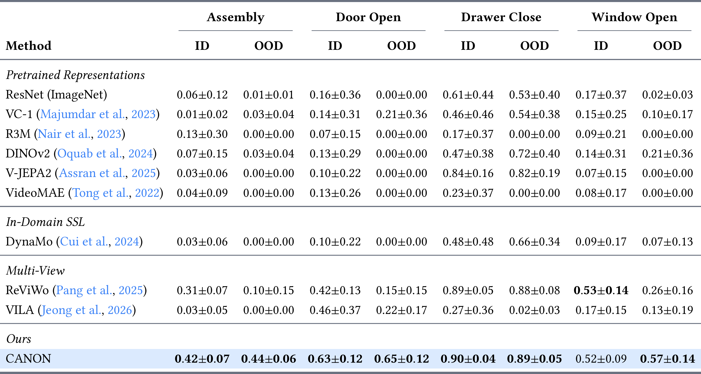
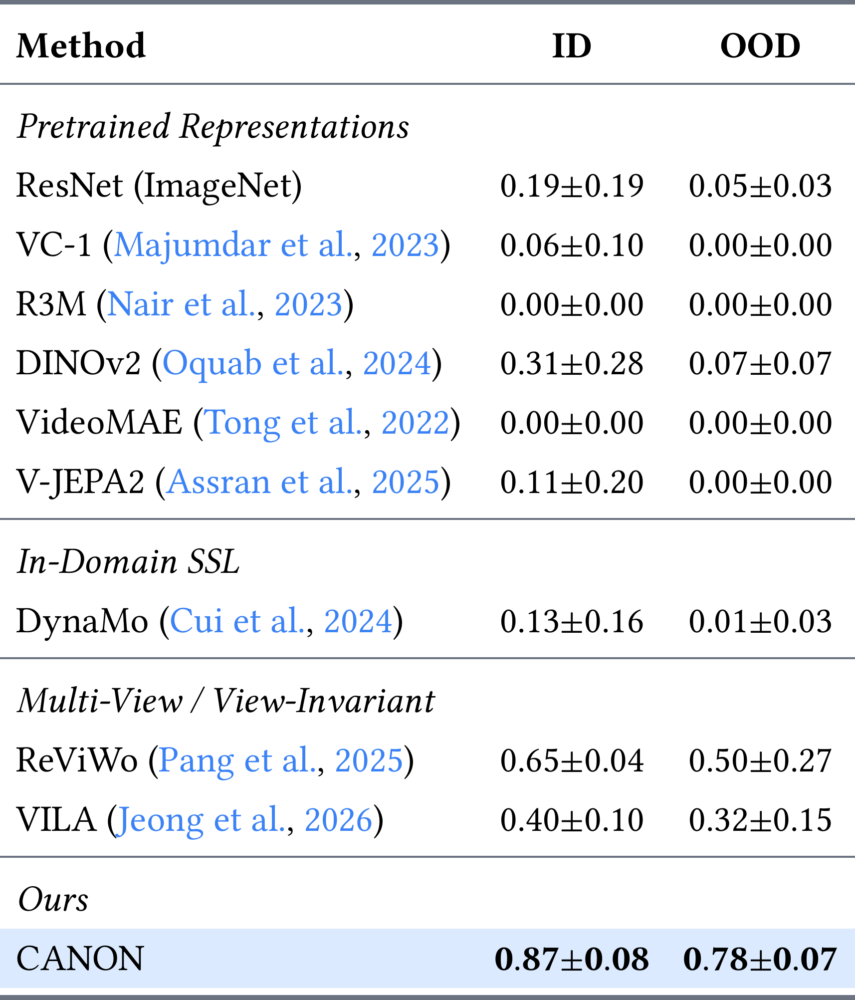
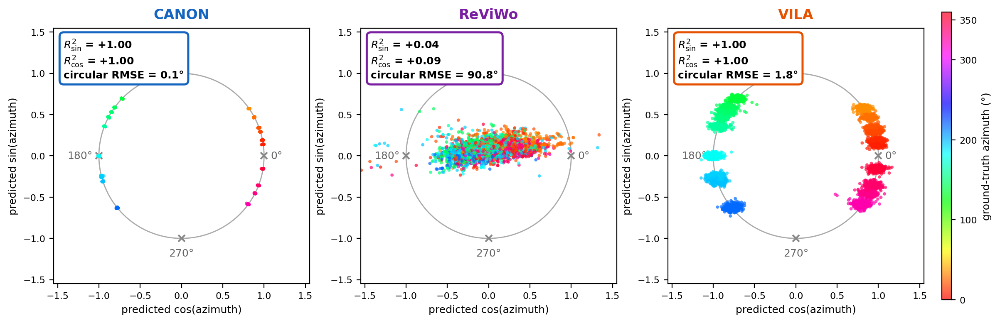

---

**[Agentic Learning AI Lab](https://agenticlearning.ai)**

---

# CANON: Canonical Observation Pretraining for Visuomotor Control

**[Yuen-Hei Yeung](https://xavhl.github.io/)**, **[Chris Hoang](https://www.chrishoang.com/)**, **[Zifan Zhao](http://zifanzhao.com/)**, **[Mengye Ren](https://mengyeren.com/)**

*New York University*

`[Code]`

---

> **TL;DR:** CANON is a self-supervised pretraining method that models camera viewpoint change as an SO(3) rotation in latent space, learning viewpoint-robust visual representations that let visuomotor policies generalize to unseen camera angles without calibration.

---

## Abstract

Visuomotor policies learned from human demonstrations are brittle to camera viewpoint changes, yet prior approaches to viewpoint robustness require extensive multi-camera data collection, known camera intrinsics, or architectural constraints that limit policy generality. We present **CANON**, a self-supervised pretraining method that learns viewpoint-robust visual representations from paired multi-view demonstrations by treating camera viewpoint change as a rotation in SO(3), capturing both azimuth and elevation angle variations. A symmetric canonical consistency objective ensures the given view maps to a canonical representation, while an angle predictor enables self-calibrated deployment without requiring known camera rotations. Across MetaWorld and LIBERO-Goal, CANON generalizes robustly to both in- and out-of-distribution camera viewpoints unseen during both model trainings, substantially outperforming internet-scale pretrained, self-supervised, and multi-view encoder baselines. Real-world robot experiments on xArm provide further evidence of CANON's viewpoint generalization ability.

---

## Overview

- **SO(3) latent dynamics for viewpoints**: CANON models camera viewpoint change as an explicit rotation operator in latent space, enabling generalization to angles outside the training distribution.
- **Self-calibrating deployment**: An angle predictor infers the camera rotation at test time from a single observation, mapping features to a canonical view with no external pose information required.
- **Strong empirical results**: CANON substantially outperforms internet-scale pretrained, self-supervised, and multi-view encoder baselines on MetaWorld, LIBERO-Goal, and real-world xArm tasks.

---

## Method


*CANON pretraining (top) and self-calibrating inference (bottom).*

CANON consists of three learned components: a **visual encoder** $f_\phi$ that maps observations to spatial feature maps $\mathbf{z}$; a lightweight **view predictor** $g_\omega$ that estimates the camera rotation relative to the canonical viewpoint, supervised by geodesic distance loss $\mathcal{L}_\text{angle}$; and a transformer-based **view forward module** $h_\psi$ that maps features between viewpoints conditioned on a continuous 4D rotation representation. During pretraining, a symmetric canonical consistency loss $\mathcal{L}_\text{can}$ and cross-view loss $\mathcal{L}_\text{xview}$ are applied over paired multi-view observations, with VICReg regularization to prevent collapse. At deployment, the encoder and view predictor infer $\hat{\mathbf{R}} \in SO(3)$ from a single observation and rotate features to the canonical space.

---

## Evaluations: viewpoint generalization across benchmarks

We evaluate CANON under systematic viewpoint perturbations targeting camera angles unseen during both encoder pretraining and policy training, against internet-scale pretrained (R3M, MVP, VC-1, VILA), SSL (DynaMo), and multi-view encoder (ReViWo) baselines.



*MetaWorld (SO(3) viewpoint variation). CANON achieves 122% improvement over ReViWo and 14× over DynaMo on OOD cameras, and is the only method with non-zero success on every OOD camera across all four tasks.*



*LIBERO-Goal (azimuth variation). CANON (0.82 ID / 0.78 OOD) roughly doubles the strongest multi-view baseline on OOD cameras and vastly outperforms SSL baselines. Real-world xArm results further confirm viewpoint generalization on physical hardware.*

---

## Analysis



*Azimuth decodability on LIBERO-Goal. CANON achieves $R^2 = 1.00$ and circular RMSE = 0.09°, confirming that viewpoint structure is precisely encoded. ReViWo's view-invariant objective suppresses this information ($R^2 \approx 0$, RMSE = 90.8°), explaining its OOD failure.*

---

## Conclusion

CANON demonstrates that modeling camera viewpoint change as an SO(3) rotation in latent space enables visuomotor policies to generalize to unseen camera angles without calibration. Future work includes extending to SE(3) for full 6-DoF camera pose canonicalization and applying the same self-supervised principle to other systematic visual perturbations.

---

## BibTeX

```bibtex
@inproceedings{yeung:2026:canon,
  title={{CANON}: Canonical Observation Pretraining for Visuomotor Control},
  author={Yuen-Hei Yeung and Chris Hoang and Zifan Zhao and Mengye Ren},
  year={2026}
}
```

---

*Part of the [Agentic Learning AI Lab](https://agenticlearning.ai) at New York University*
